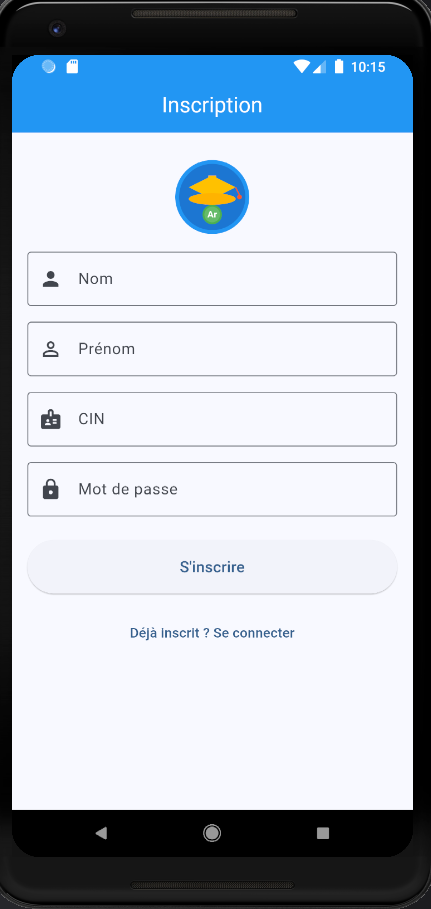
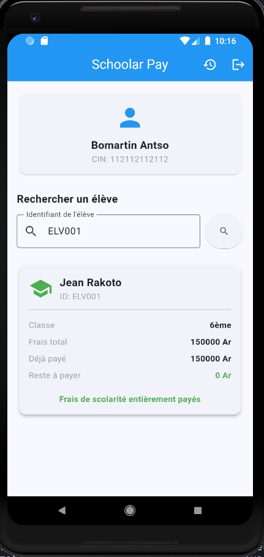

<p align="center">
  
</p>

<h1 align="center">Schoolar Pay</h1>

<p align="center">
  <strong>Application de paiement de frais de scolarite</strong>
</p>

<p align="center">
  
  
  
  
</p>

---

## Description

**Schoolar Pay** est une application mobile Flutter permettant aux parents de payer les frais de scolarite de leurs enfants de maniere simple et rapide. Cette application est un MVP (Minimum Viable Product) developpe dans le cadre d'un projet scolaire.

### Fonctionnalites principales

- **Inscription et Connexion** : Systeme d'authentification securise avec CIN et mot de passe
- **Recherche d'eleve** : Trouver un eleve par son identifiant unique
- **Paiement simplifie** : Payer les frais de scolarite en un clic (simulation)
- **Historique** : Consulter l'historique de tous les paiements effectues
- **Multi-plateforme** : Fonctionne sur Android, iOS, Web et Desktop

---

## Captures d'ecran

<p align="center">
  
  &nbsp;&nbsp;&nbsp;
  
  &nbsp;&nbsp;&nbsp;
  
</p>

<p align="center">
  <em>De gauche a droite : Connexion, Inscription, Paiement</em>
</p>

---

## Pre-requis

Avant d'installer l'application, assurez-vous d'avoir :

| Outil | Version minimale | Lien |
|-------|------------------|------|
| Flutter | 3.10.0 | [flutter.dev](https://flutter.dev/docs/get-started/install) |
| Dart | 3.0.0 | Inclus avec Flutter |
| Android Studio | Derniere version | [developer.android.com](https://developer.android.com/studio) |
| Xcode (macOS) | Derniere version | App Store |

### Verifier votre installation

```bash
flutter --version
flutter doctor
```

---

## Installation

### 1. Cloner le projet

```bash
git clone https://github.com/jussherima/schoolar-pay.git
cd schoolar-pay
```

### 2. Installer les dependances

```bash
flutter pub get
```

### 3. Lancer l'application

#### Option A : Utiliser les scripts fournis

**Linux / macOS :**
```bash
./run.sh
```

**Windows :**
```cmd
run.bat
```

#### Option B : Commande Flutter directe

```bash
# Sur un appareil connecte ou emulateur
flutter run

# Sur le web
flutter run -d chrome

# Sur desktop (Linux)
flutter run -d linux

# Sur desktop (macOS)
flutter run -d macos

# Sur desktop (Windows)
flutter run -d windows
```

---

## Structure du projet

```
schoolar-pay/
├── lib/
│   ├── main.dart                 # Point d'entree de l'application
│   ├── models/
│   │   ├── parent.dart           # Modele Parent
│   │   ├── eleve.dart            # Modele Eleve
│   │   └── paiement.dart         # Modele Paiement
│   ├── services/
│   │   └── database_service.dart # Service de base de donnees SQFlite
│   ├── screens/
│   │   ├── login_screen.dart     # Ecran de connexion
│   │   ├── inscription_screen.dart # Ecran d'inscription
│   │   ├── home_screen.dart      # Ecran principal
│   │   ├── paiement_screen.dart  # Ecran de paiement
│   │   └── historique_screen.dart # Ecran d'historique
│   └── widgets/
│       └── app_logo.dart         # Widget du logo
├── assets/
│   └── images/
│       └── logo.svg              # Logo de l'application
├── img/                          # Images pour la documentation
├── run.sh                        # Script de lancement Linux/macOS
├── run.bat                       # Script de lancement Windows
├── DATA.md                       # Documentation des donnees de test
├── charge.md                     # Cahier des charges
└── README.md                     # Ce fichier
```

---

## Base de donnees

L'application utilise **SQFlite** pour stocker les donnees localement sur l'appareil.

### Schema de la base de donnees

```
┌─────────────────┐       ┌─────────────────┐       ┌─────────────────┐
│     parents     │       │     eleves      │       │    paiements    │
├─────────────────┤       ├─────────────────┤       ├─────────────────┤
│ id (PK)         │       │ id (PK)         │       │ id (PK)         │
│ nom             │       │ identifiant     │       │ parent_id (FK)  │
│ prenom          │       │ nom             │       │ eleve_id (FK)   │
│ cin (UNIQUE)    │       │ prenom          │       │ montant         │
│ mot_de_passe    │       │ classe          │       │ date            │
└─────────────────┘       │ frais_total     │       └─────────────────┘
                          │ frais_paye      │
                          └─────────────────┘
```

---

## Donnees de test

L'application contient des eleves pre-enregistres pour les tests :

| Identifiant | Nom | Prenom | Classe | Frais Total | Reste a payer |
|-------------|-----|--------|--------|-------------|---------------|
| `ELV001` | Rakoto | Jean | 6eme | 150 000 Ar | 150 000 Ar |
| `ELV002` | Rasoa | Marie | 5eme | 150 000 Ar | 100 000 Ar |
| `ELV003` | Rabe | Paul | 4eme | 175 000 Ar | 175 000 Ar |
| `ELV004` | Ravao | Lina | 3eme | 175 000 Ar | 75 000 Ar |
| `ELV005` | Randria | Hery | Terminale | 200 000 Ar | 200 000 Ar |

> Consultez [DATA.md](DATA.md) pour plus de details.

---

## Guide d'utilisation

### 1. Inscription

1. Lancez l'application
2. Cliquez sur "Pas encore inscrit ? S'inscrire"
3. Remplissez le formulaire (Nom, Prenom, CIN, Mot de passe)
4. Cliquez sur "S'inscrire"

### 2. Connexion

1. Entrez votre CIN
2. Entrez votre mot de passe
3. Cliquez sur "Se connecter"

### 3. Rechercher un eleve

1. Sur l'ecran principal, entrez l'identifiant de l'eleve (ex: `ELV001`)
2. Cliquez sur le bouton de recherche
3. Les informations de l'eleve s'affichent

### 4. Effectuer un paiement

1. Apres avoir trouve l'eleve, cliquez sur "Payer"
2. Entrez le montant ou utilisez les boutons rapides
3. Cliquez sur "Payer"
4. Une confirmation s'affiche

### 5. Consulter l'historique

1. Cliquez sur l'icone d'historique dans la barre d'application
2. La liste de tous vos paiements s'affiche

---

## Technologies utilisees

| Technologie | Utilisation |
|-------------|-------------|
| **Flutter** | Framework de developpement mobile cross-platform |
| **Dart** | Langage de programmation |
| **SQFlite** | Base de donnees SQLite locale |
| **flutter_svg** | Affichage des images SVG |
| **Material Design 3** | Design system de l'interface |

---

## Scripts de lancement

Les scripts `run.sh` (Linux/macOS) et `run.bat` (Windows) offrent :

- Verification automatique de la version Flutter
- Installation des dependances si necessaire
- Menu interactif pour choisir la plateforme cible
- Messages d'erreur clairs en cas de probleme

### Exemple d'execution

```
========================================
       SCHOOLAR PAY - Lancement
========================================

[INFO] Flutter detecte: v3.29.3
[INFO] Version minimale requise: v3.10.0

[OK] Version Flutter compatible

Plateforme detectee: linux

Choisissez une option:
  1) Lancer sur appareil connecte (mobile/emulateur)
  2) Lancer sur linux (desktop)
  3) Lancer sur Chrome (web)
  4) Afficher les appareils disponibles
  5) Quitter

Votre choix [1-5]:
```

---

## Contribuer

Les contributions sont les bienvenues ! Pour contribuer :

1. Forkez le projet
2. Creez une branche (`git checkout -b feature/nouvelle-fonctionnalite`)
3. Committez vos changements (`git commit -m 'Ajout d'une nouvelle fonctionnalite'`)
4. Poussez sur la branche (`git push origin feature/nouvelle-fonctionnalite`)
5. Ouvrez une Pull Request

---

## Auteurs

- **jussherima** - Developpement initial

---

## Licence

Ce projet est sous licence MIT. Voir le fichier [LICENSE](LICENSE) pour plus de details.

---

## Remerciements

- [Flutter](https://flutter.dev/) - Framework de developpement
- [SQFlite](https://pub.dev/packages/sqflite) - Base de donnees locale
- [Material Design](https://material.io/) - Guidelines de design

---

<p align="center">
  <strong>Schoolar Pay</strong> - Simplifiez le paiement des frais de scolarite
</p>
